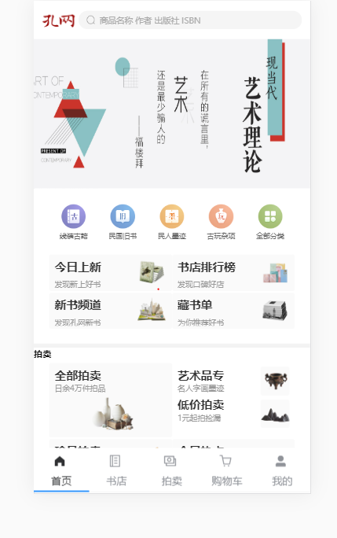
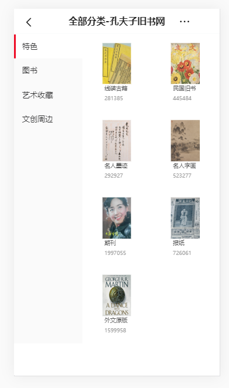
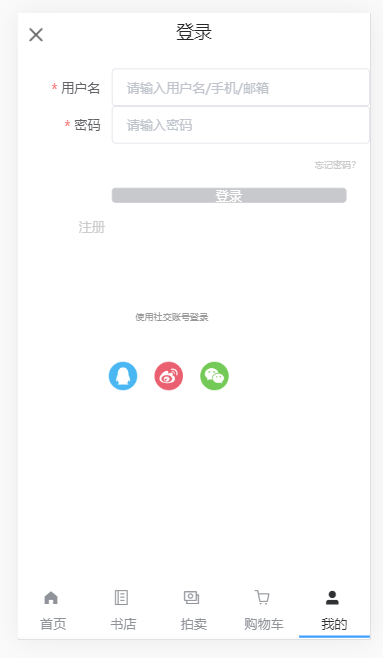
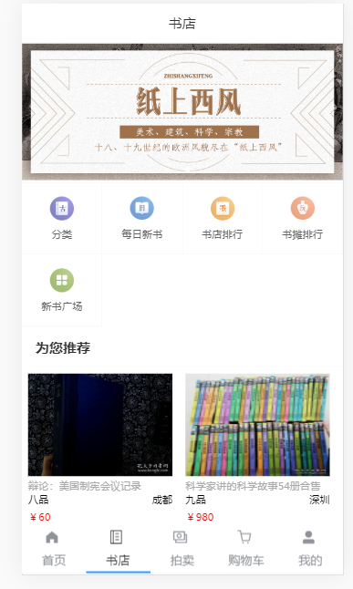

## 项目开发
* 项目名称：孔夫子旧书网
* 官网：       https://m.kongfz.com/
* 上线网址：   http://114.215.146.121:1911/#/home

* 团队与分工
* 组长：萧景铭 ，副组长：李杰
* 负责模块说明
      * 萧景铭：搭建项目脚手架、安装基本的插件；
          * 负责用nodejs搭建后台服务器，并且写好接口
          * 爬取数据并且保存到本地mongodb数据库
          * 完成列表页的样式以及各种功能
          * 完成详情页的样式以及各种功能
          * 完成分类页的样式以及各种功能
          * 完成首页的样式以及各种功能
          * 编写路由的配置，实现底部导航栏跳转 
          * 项目上线
      * 李杰：完成了“我的”页面的样式以及功能
          * 实现注册页的样式以及功能
          * 实现登陆页的样式以及功能（包括token校验）
          * 完成购物车的样式以及各种功能
          * 购物车添加收藏夹功能
          * 使用了全局路由守卫来设置权限（登录后才能访问购物车）
          * 完成拍卖页、书店页的样式
          * 项目上线
* 项目截图
* 首页
* 分类页

* 列表页

* 详情页

* 登录页

* 注册页

* 个人中心页

* 退出登陆页

* 购物车页

* 书店页

* 
* 

